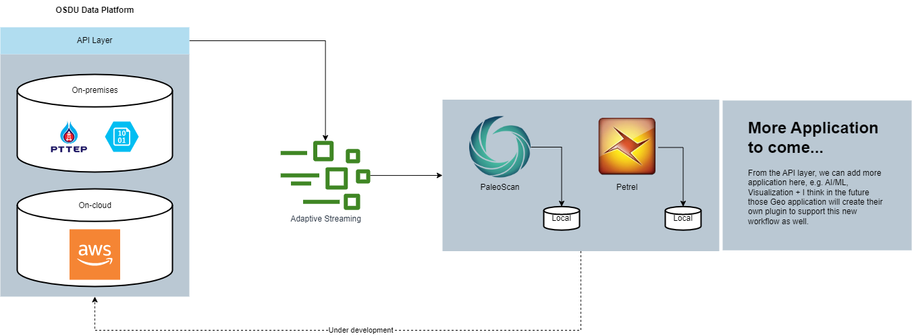

# What is OSDU?
OSDU (Open Standard Data Platform for Upstream) is an open data platform for the upstream oil and gas industry. It is designed to provide a standardized, cloud-based platform for storing and managing data related to exploration, drilling, and production activities in the upstream oil and gas industry. The goal of OSDU is to improve data interoperability and accessibility within the industry, enabling more efficient and effective data management and analysis. OSDU is being developed by the OSDU Forum, a consortium of oil and gas companies and technology providers working together to define and implement the platform.

### Architecture overview
OSDU will act as a platform to manage and stream the data from the platform to target application via the APIs

### OSDU members
- https://www.opengroup.org/osdu/current-members

### OSDU adoption
- [Halliburton](https://www.halliburton.com/en/events/managing-making-the-most-of-your-seismic-data-on-osdu)
- [Schlumberger](https://www.software.slb.com/data/guide-to-osdu-data-platform)
- [PaleoScan](https://www.eliis-geo.com/documents/Documents/Brochure_2022_web.pdf)
- [CGG](https://www.cgg.com/industry-applications/digital/data-management-access)

### Repositories
- Open VDS: https://community.opengroup.org/osdu/platform/domain-data-mgmt-services/seismic/open-vds
- Seismic Store: https://community.opengroup.org/osdu/platform/domain-data-mgmt-services/seismic/seismic-dms-suite/seismic-store-service

### Key features of OSDU platform
- Decouple the data from the (geo)application.
- We can use blob storage which is much cheaper than the normal storage.
- Default file format for seismic data is `OpenVDS` and `VDS`
    - `OpenVDS` is the bricked format that allow you to access the part of the bricks(headers, trace)
    - Supported data types 
- There are differnt impact to the data when you are using `OpenVDS` and `VDS`
    - we have to look in the detail what are those `Almost None and Some` that stated in the documents
    - 
- Reduce the cost of storage, since we can store our data as a blob in the cold tier storage of the public cloud providers
- Enable the cross-application data transfer using `OpenVDS`, we don't need to convert the file to match the required format of the application.
- The OpenVDS allow random access to the data so that the user can work with a particular range of inline/xline from the start
- This could allow the users to prefetch the data before they pick the data to work.
- More data types are being supported(horizons, pre-stack, attributes volume)
 - OpenVDS is claimed that this file format is serverless, can spread across thousands of objects and it's blazingly fast, Blueware call this technology Flexible Access Storage Transcoder(FAST)
- The FAST streaming has 2 storage options, on-premise and on-cloud 
  - 
- There are options for the implementations as well
  - 
- To work with Petrel 3D post stack, it's recommened to use `OpenZGY` format rather than `OpenVDS`
  - `OpenZGY` also supported the `OpenVDS` conversion
  - Schlumberger is support and developed the `OpenZGY` format

### Repositories
- https://community.opengroup.org/osdu/platform/domain-data-mgmt-services/seismic/open-vds
- https://community.opengroup.org/osdu/platform/domain-data-mgmt-services/seismic/seismic-dms-suite/seismic-store-service

### My questions
- How to ensure that the data converted to `OPENVDS` is the same as the original data?
  - can we convert back and compare the hash ?
  - can we load to some application and export to see the difference?
- How can I access the member only content?
  - 
- How could we integrate this standard with the existing seismic data management system?
  - Prosource ?